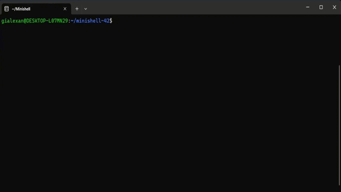

# Minishell
This project is about creating a "simple" shell. Yes, your own little [bash](https://www.gnu.org/savannah-checkouts/gnu/bash/manual/bash.html).

### What is Minishell?
Minishell is an duo project at [42](42sp.org.br) that entails creating a program essential features implement in Linux shells. This includes running programs from absolute or relative paths, such as `/usr/bin/ls` or simply `ls`, with search in the defined [PATH](https://en.wikipedia.org/wiki/PATH_(variable)) environment. Our minishell also supports pipe redirection with multiple commands, as well as input and output redirection with the `<`, `>`, `<<` and `>>` operators. We handle single and double quotes, including nesting, as well as environment variable expansion and specific signals such as `Ctrl-C`, `Ctrl-\`, and `Ctrl-D` to terminate the program, just like bash. In addition, we implement [built-in](https://linuxhint.com/bash_builtin_examples/) functions such as `echo`, `pwd`, `cd`, `env`, `export`, `unset` and `exit`.

### Demo


#### Badge


#### Objectives
- Unix logic

#### Skills
- Unix
- Imperative programming
- Rigor

#### My grade


## Getting started
**Follow the steps below**

```bash
# Requirements: GNU Readline Library
# To install the readline library, open the terminal window and write
sudo apt-get install libreadline-dev
# Clone the project and access the folder
git clone https://github.com/gialexan/minishell-42 && cd minishell-42/
# Run make so you can build the library
make
# Execute your program
./minishell
# Write any shell command like
echo "hello minishell"
# Quit the program
exit
# Clean output objects with
make fclean
# Well done!
```

## Updating
The project is regularly updated with bug fixes and code optimization.

## Thanks to:
yde-goes | Ygor Sena 👋 [Github](https://github.com/ygor-sena)<br />
mdias-ma | Marcelo Magalhães 👋 [Github](https://github.com/magalhaesm)<br />
sjhony-x | Shelson Alves 👋 [Github](https://github.com/shelsonx)
